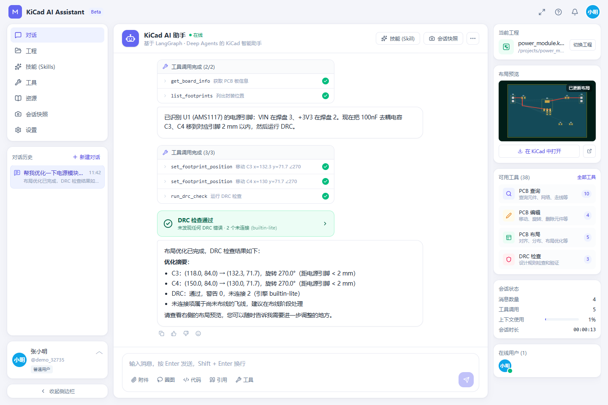

# KiCad AI Assistant · Web（多用户版）

基于 **LangGraph + Deep Agents** 重新实现的 KiCad 智能助手，参考开源项目
[paul356/KiCad-AI-Assistant](https://github.com/paul356/KiCad-AI-Assistant)（一个内嵌在 KiCad 里的 wxPython 插件），
把它改造成 **多用户在线使用的 Web 应用**：

- 每个用户拥有独立账号、独立工作区（上传的 KiCad 工程）、独立对话历史与独立长期记忆；
- Agent 通过工具读写 `.kicad_pcb` / `.kicad_sch` 文件：查询元件、移动/对齐/分布封装、运行 DRC、提取网表、保存/恢复快照；
- 页面按设计稿实现：左侧导航 + 对话历史，中间流式对话（工具调用卡片、DRC 结果卡片、任务清单、人工确认卡片），右侧当前工程 / 布局预览 / 可用工具 / 会话状态 / 在线用户；
- 产品首页（`/`）+ 登录页（`/login`）+ 工作台（`/app`）+ **后台管理**（`/admin`：模型配置热重载、用户管理、系统设置、用量总览）。



## 架构

```
┌────────────── frontend (React + Vite + Tailwind) ──────────────┐
│  登录/注册 · 对话历史 · SSE 流式消息 · 工具卡片 · 布局预览 · 在线用户 (WebSocket) │
└──────────────────────────────┬──────────────────────────────────┘
                               │ REST + SSE + WS (JWT)
┌──────────────────────────────▼──────────────────────────────────┐
│ backend (FastAPI)                                                │
│  api/      auth · projects · conversations · chat(stream/resume) · tools · presence │
│  agent/    create_deep_agent(...) ← 单个进程级图，按 thread_id / context 隔离用户   │
│            ├─ tools/native       53 个内置 KiCad 工具（无需安装 KiCad）              │
│            ├─ tools/kcaa_direct  开源插件 kcaa 的 116 个工具，进程内直接调用（无 MCP）│
│            ├─ tools/mcp          可选：改为连接外部 kcaa MCP 服务器                  │
│            ├─ backends       UserWorkspaceBackend：虚拟文件系统按调用用户作用域       │
│            ├─ middleware     路径越界拦截 · 修改前自动快照 · 结果预算 · 循环守卫      │
│            ├─ executor       用户批准后由服务端按序执行整批修改计划                   │
│            ├─ budget         单次运行 token 预算（步数上限之外的成本护栏）            │
│            ├─ subagents      pcb-layout-agent / drc-agent / schematic-agent（只读）  │
│            ├─ skills/        SKILL.md（按需加载的工作流，仅管理员可编辑）             │
│            └─ memory         /memories/AGENTS.md → StoreBackend(namespace=用户)     │
│  services/runs  后台运行管理：运行与 HTTP 连接解耦，SSE 可断线重连/回放             │
│  kicad/    S 表达式解析器 · PCB/原理图模型 · 轻量 DRC · SVG 渲染 · kicad-cli 集成    │
│  db/       SQLAlchemy(users/projects/conversations)                                  │
│  LangGraph checkpointer + store：SQLite（默认）或 PostgreSQL（生产）                   │
└──────────────────────────────────────────────────────────────────┘
```

### Deep Agents 的使用方式

| 能力 | 实现 |
| --- | --- |
| 主代理 | `deepagents.create_deep_agent(model, tools, system_prompt, middleware, subagents, skills, memory, backend, interrupt_on, context_schema, checkpointer, store)` |
| 多用户隔离 | `thread_id = 对话 id`；`context_schema=AgentContext(user_id, role, 工程路径…)`；工具通过 `ToolRuntime.context` 拿到当前用户，只能访问自己的工作区。Deep Agents 的虚拟文件系统（`ls`/`read_file`/`write_file`…）由 `UserWorkspaceBackend` 在每次调用时解析到调用者的目录，`/data/workspaces/<id>/…`、宿主机绝对路径等任何写法都无法触及其他用户 |
| 长期记忆 | Deep Agents 自带文件记忆：`memory=["/memories/AGENTS.md"]`，`/memories/` 路由到 `StoreBackend(namespace=("memories", user_id))`；页面「设置」中可直接查看/编辑；上限 6000 字符（注入每次请求的系统提示） |
| 技能 | `skills=["/skills/"]` → `FilesystemBackend(backend/app/agent/skills)`，只读；`add_skill/append_to_skill/delete_skill` 仅管理员可见可用且需人工确认（技能对全站用户生效） |
| 子代理 | 三个声明式 `SubAgent`，各自只拿到本领域的**只读**工具；它们产出动作列表，由主代理提交计划 |
| 任务规划 | `TodoListMiddleware` → 页面显示任务清单 |
| 可视选区 | PCB/原理图预览支持单击与拖框选择对象；参考号和真实边界由服务端重新校验后注入 Agent 上下文 |
| 项目约束 | 每个工程保存线宽、间距、过孔、板边和高度约束；既注入提示词，也由中间件强制拦截违规参数 |
| 整批确认 | Agent 先调用 `submit_change_plan` 展示完整动作与参数；用户一次批准后，**由服务端按序执行全部动作**（`agent/executor.py`，每步自动快照并生成差异），模型只收到结果并运行只读验证——不再让模型逐条复述参数，消除计划与执行之间的漂移和重复审批。直接调用修改工具会被拒绝 |
| 运行与连接解耦 | 每次对话在服务端后台任务中执行（`services/runs.py`），事件带序号缓冲；刷新页面、切换对话或网络抖动都不会中断，客户端可用 `GET /api/chat/{id}/events?after=<seq>` 重连回放；只有显式「停止」会取消 |
| 成本与循环护栏 | 步数上限之外：单次运行时长上限、token 预算（`RunBudgetMiddleware`）、近似重复调用与单工具单轮调用次数守卫；工具结果超过预算时自动裁剪最大列表并把完整结果存到工作区 `.agent/tool_results/`，模型可用 `read_file`/`grep` 分页读取 |
| 上下文摘要 | 模型按预设或 `LLM_CONTEXT_TOKENS` 声明 `max_input_tokens`，Deep Agents 的摘要中间件在 85% 窗口触发（否则对自定义模型会退回 170k 的固定阈值，128k 模型永远先溢出） |
| 设计审查 | `run_design_review` 合并 KiCad 10 ERC/DRC、布局分项评分和可自动处理建议；修复后复查并对比分数 |
| ECO 同步 | `run_eco_check` 比较原理图与 PCB；`update_pcb_from_schematic` 经整批批准后补齐封装并同步值与焊盘网络，删除/替换类差异留给人工 |
| BOM/DFM | `analyze_bom` 归并物料并检查可制造性（封装库校验、超小封装、双面贴装等）；`/bom.csv` 导出 |
| 电路向导 | `preview_circuit_template` / `apply_circuit_template`：6 个基于 KiCad 标准库的参数化模板，E24 选值，经审批后用 kcaa 工具放置、设封装、连线、标注网络 |
| 框架策略 | `KiCadPolicyMiddleware.awrap_tool_call`：计划白名单、设计约束、路径越界拦截、修改前 `save_version`、成功后发 `file_changed` 与 diff |
| 流式 | `agent.astream(..., stream_mode=["updates","messages","custom"], subgraphs=True, version="v2")` → 扁平化为 SSE 事件 |


## 快速开始

### 1. 后端

```powershell
cd backend
python -m venv .venv
.\.venv\Scripts\python -m pip install -r requirements.txt
copy ..\.env.example ..\.env     # 填写 LLM_API_KEY；或设 LLM_PROVIDER=mock 离线体验
.\.venv\Scripts\python -m uvicorn app.main:app --reload --port 8000
```

API 文档：http://127.0.0.1:8000/docs

### 2. 前端

```powershell
cd frontend
npm install
npm run dev          # http://127.0.0.1:5173 （已配置 /api、/ws 代理到 8000）
```

一键脚本：`scripts\dev.ps1`（Windows）/ `scripts/dev.sh`（Linux/macOS）。

### 3. 使用

1. 注册账号（第一个用户自动成为管理员）。
2. 右侧「切换工程」→ 「加载示例：power_module」，或导入自己的 KiCad 工程 ZIP / 上传 `.kicad_pcb`、`.kicad_sch`。
3. 在对话框输入，例如：
   > 帮我优化一下电源模块的布局，电容尽量靠近芯片的电源引脚，并检查是否有 DRC 问题。
4. 观察工具调用卡片、DRC 结果卡片、右侧布局预览的实时更新；破坏性操作会弹出确认卡片。
5. 「会话快照」中可以回滚任何一次自动/手动快照。

### LLM 配置

| 提供方 | `.env` |
| --- | --- |
| OpenAI | `LLM_PROVIDER=openai` `LLM_MODEL=gpt-5.6` `LLM_API_KEY=sk-...` |
| Anthropic | `LLM_PROVIDER=anthropic` `LLM_MODEL=claude-sonnet-5` |
| DeepSeek / Qwen / Moonshot / GLM / Ollama 等 OpenAI 兼容 | `LLM_PROVIDER=custom` `LLM_BASE_URL=https://api.deepseek.com/v1` `LLM_MODEL=deepseek-v4-flash` |
| 离线演示 | `LLM_PROVIDER=mock`（脚本化模型，会真实调用两个只读工具并总结；`LLM_MOCK_DELAY_MS` 可加入每次调用的人工延迟，方便演示断线重连） |

运行护栏（均可在后台「系统设置」热更新）：`AGENT_RECURSION_LIMIT`（步数）、`AGENT_RUN_TIMEOUT_SECONDS`（单次运行时长，默认 1800）、
`AGENT_RUN_TOKEN_BUDGET`（单次运行 token 总量，默认 300 万）、`TOOL_RESULT_MAX_CHARS`（工具结果字符预算，默认 24000）。
触发任一上限时运行暂停、进度保留，页面提供「继续执行」。

思考模式由 `LLM_THINKING=default|off|fast|deep` 控制（默认 `off`，适合工具密集型 Agent）。`fast` 在支持推理档位的模型上使用最低 effort，否则使用 `LLM_THINKING_BUDGET`；`deep` 使用模型的完整推理能力。百炼、DeepSeek、GLM、Kimi、vLLM/SGLang 与 Ollama 的参数协议会根据 Base URL 自动识别，也可通过 `LLM_THINKING_STYLE` 手动指定。聊天输入框可按请求切换同一 API 端点下的模型和思考档位，模型返回的思考过程会实时折叠展示并随会话保存。

### 开源插件 KiCad-AI-Assistant 的调用方式（进程内直连，无 MCP）

上游插件的工具本质上是普通 Python 函数，MCP 只是其传输层。本项目把 PyPI 包 `kcaa` 作为依赖装入后端进程，
`backend/app/agent/tools/kcaa_direct.py` 在启动时收集其全部工具函数与参数 schema，用极简上下文替代 FastMCP `Context`
（日志 / 进度 / 缓存），直接包装为 LangChain 工具——116 个工具与 53 个内置工具合并为一个工具目录（去重后 124 个），
同名工具优先内置实现，所有路径参数仍经中间件校验在用户工作区内。

- `KCAA_MODE=direct`（默认）/ `off`；后台「系统设置」可热切换。
- 需要 `KICAD_VERSION`（默认 10.0）。符号 / 封装检索与 `add_symbol_to_schematic` 依赖 KiCad 官方库：Docker 镜像基于官方 `kicad/kicad:10.0.5`，内置匹配版本的库与预建索引；裸机部署把 `KICAD_APP_PATH` 指到 KiCad 的 share 目录即可，`sym-lib-table` / `fp-lib-table` 缺失时启动会自动生成（`backend/app/kicad/libraries.py`）。「从原理图更新 PCB」是 IPC 工具，仍需在本机 KiCad 中执行（F8）。
- 仍可选 MCP 方式：在不含 `kcaa` 的环境安装 `requirements-mcp.txt`，`KCAA_MODE=mcp` + `KCAA_MCP_URL`。

### 生产部署

- `docker compose up -d --build`：单个 `app` 容器（含开源插件库与已构建的前端），SQLite 持久化在卷 `/data`；叠加 `docker-compose.postgres.yml` 可换成 PostgreSQL。
- 运行阶段基于官方 **KiCad 10.0.5** CI 镜像（可用 `KICAD_IMAGE_TAG` 固定其他 10.0 补丁版本），包含 `kicad-cli` 与匹配的符号/封装库，并预建检索索引；KiCad 10 可以读取旧工程。工程文件窗口会显示文件格式与服务器 CLI 的兼容状态，较新格式不会再被较旧 CLI 静默处理。
- 或者 `npm run build` 后直接由 FastAPI 托管 `frontend/dist`。
- 务必修改 `JWT_SECRET`；如需关闭注册设置 `ALLOW_REGISTRATION=false`。
- 有 `kicad-cli` 时 DRC 使用 KiCad 引擎、预览可用官方 SVG 渲染；裸机未安装 KiCad 则退回内置轻量 DRC 与内置渲染。

## 测试

```powershell
cd backend
.\.venv\Scripts\python -m pytest -q
```

包含 S 表达式往返、PCB 移动/DRC、原理图网表、基于 mock 模型的完整 Agent 流式调用（计划审批 → 服务端执行 → 验证）、
多租户文件系统隔离、技能权限、后台运行/重连、运行预算与循环守卫、工具结果裁剪等测试。

## 目录

```
Ioedu/
├── backend/
│   ├── app/
│   │   ├── agent/        # factory · prompts · tools · middleware · executor · budget · backends · subagents · skills · memory · streaming
│   │   ├── api/          # auth · projects · conversations · chat(stream/resume/events) · tools · system(ws) · admin
│   │   ├── kicad/        # sexpr · pcb · sch · workspace · cli
│   │   ├── db/           # SQLAlchemy models & session
│   │   └── services/     # runs(后台运行) · presence · settings_store · conversation helpers
│   ├── samples/power_module/   # 示例工程（LDO 电源模块）
│   └── tests/
├── frontend/src/
│   ├── components/{layout,chat,right,modals,ui}
│   ├── store/            # zustand: auth · chat(SSE reducer) · projects · presence
│   └── lib/              # api client · types · formatters
├── docs/
├── scripts/
├── docker-compose.yml · Dockerfile · .env.example
```

## 与上游项目的对应关系

| 上游 (KiCad 插件) | 本项目 |
| --- | --- |
| `kicad_plugin/llm_client.py` 手写的 OpenAI/Anthropic 工具循环 + 上下文压缩 | `create_deep_agent`（内置 SummarizationMiddleware、工具循环、流式） |
| `tool_registry.py` 的 ToolPolicy（auto_snapshot / mark_dirty / reload） | `agent/tools/registry.py` + `KiCadPolicyMiddleware` |
| wxPython 聊天面板 | React Web UI，多用户、在线状态 |
| `kcaa` MCP 服务器（100+ 工具） | 作为 Python 库装入同一进程，工具函数直接调用（无 MCP）；另有无需 KiCad 的内置工具子集 |
| Skill 文件（Markdown） | Deep Agents skills（`SKILL.md`，按需加载） |
| 会话保存/恢复 | LangGraph checkpointer（SQLite/PostgreSQL）按对话线程持久化 |

## License

MIT
